<div align="center">


# Nakhat Finjan — Coffee Loyalty System

**A production loyalty programme for a real coffee shop in Zarqa, Jordan.**
Point-of-sale, customer mobile app, and marketing site — one backend, one deployment, live in production.

[](https://nakhatfinjan.com)
[](#)
[](#)
[](#)
[](#)

</div>

---

## What this is

A coffee shop was running its loyalty programme on **paper punch cards**. Customers lost them, staff mis-punched them, and nobody could tell what the programme was costing.

This replaces that with three surfaces over one API:

| Surface | Who uses it | What it does |
|---|---|---|
| 🖥️ **POS dashboard** | Cashiers & the owner | Ring up orders, redeem points, process returns, manage the catalogue and staff |
| 📱 **Customer app** | Customers | Phone-number sign-in, live points balance, purchase history, the menu |
| 🌐 **Marketing site** | Everyone | Menu with photos, story, contact, and the Android download page |

All three ship as **a single deployment** on one origin — the API serves the site at `/`, the dashboard at `/dashboard`, and itself at `/api`.

**67 real customers and 7,243 points were migrated off the paper cards** at the rate those cards were punched under, which was not the rate the system runs on today.

---

## Screens

### Customer app — Flutter, Arabic, RTL

<div align="center">
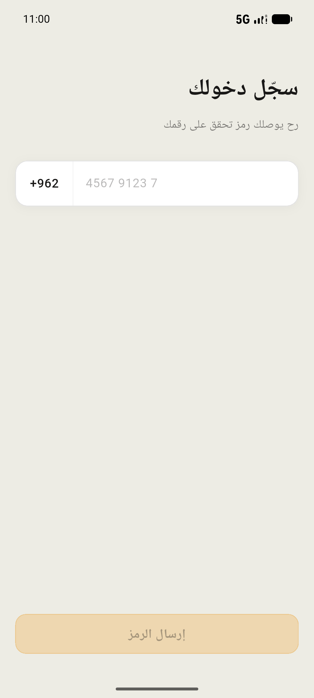
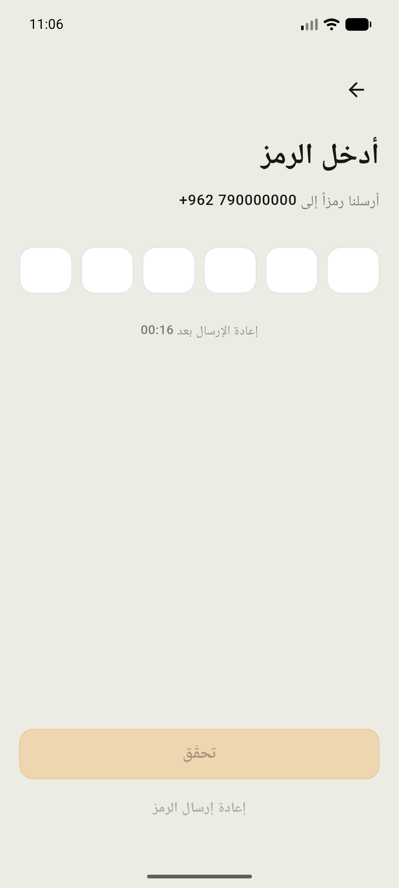
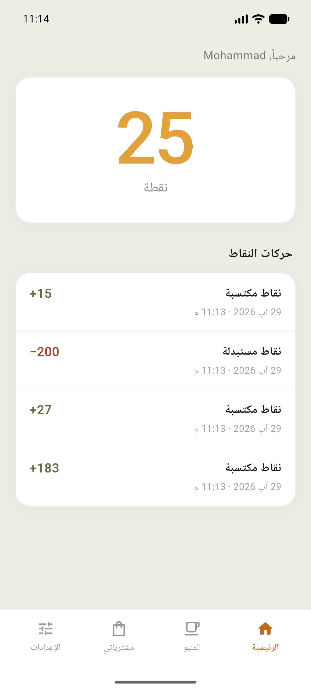
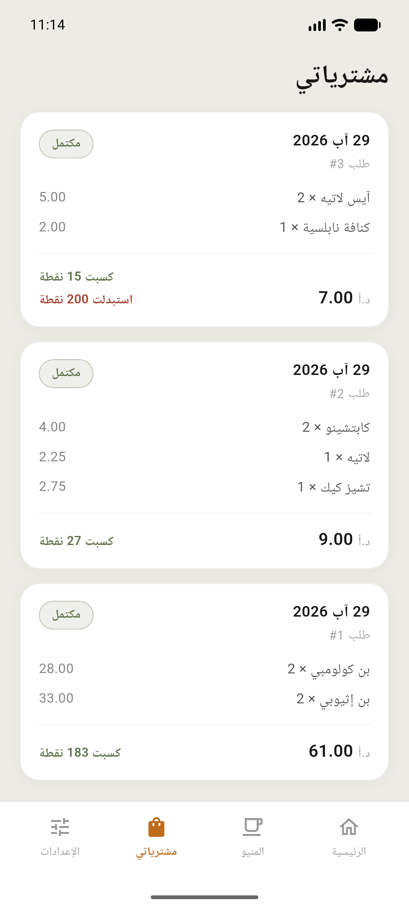
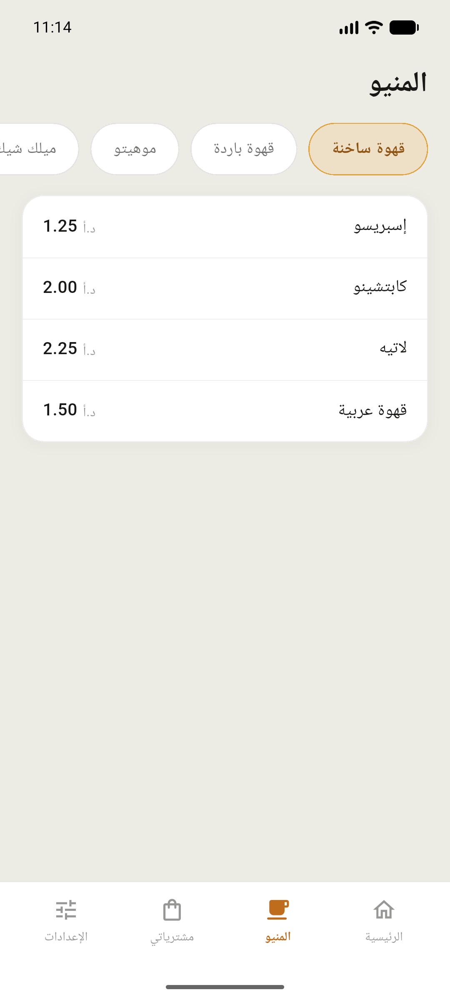
</div>

<div align="center"><sub>Sign in · Verification code · Balance & points ledger · Purchases · Live menu</sub></div>

### POS dashboard — React, touch-first

<div align="center">
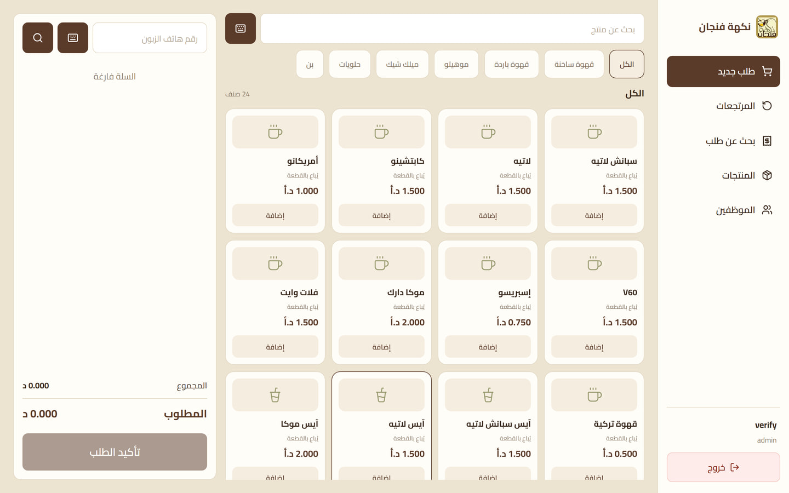
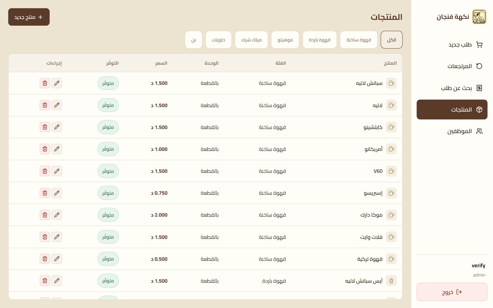
</div>
<div align="center">
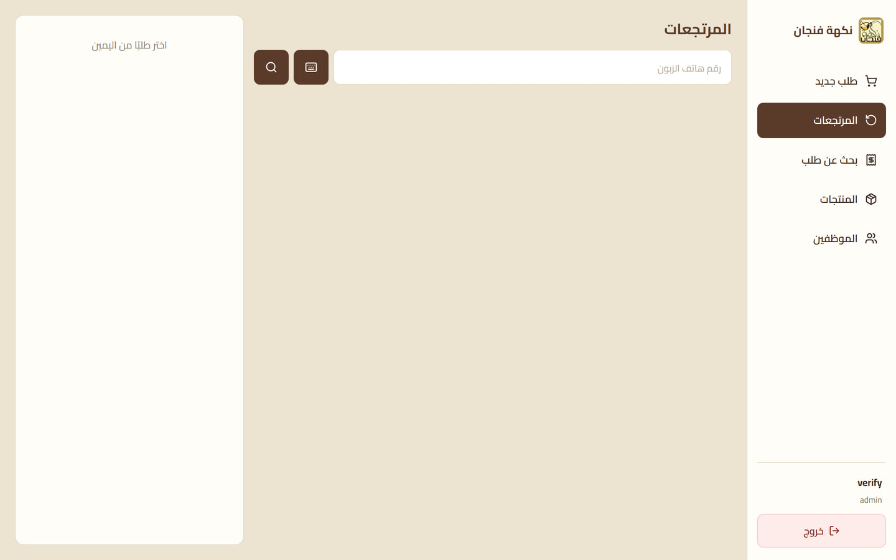
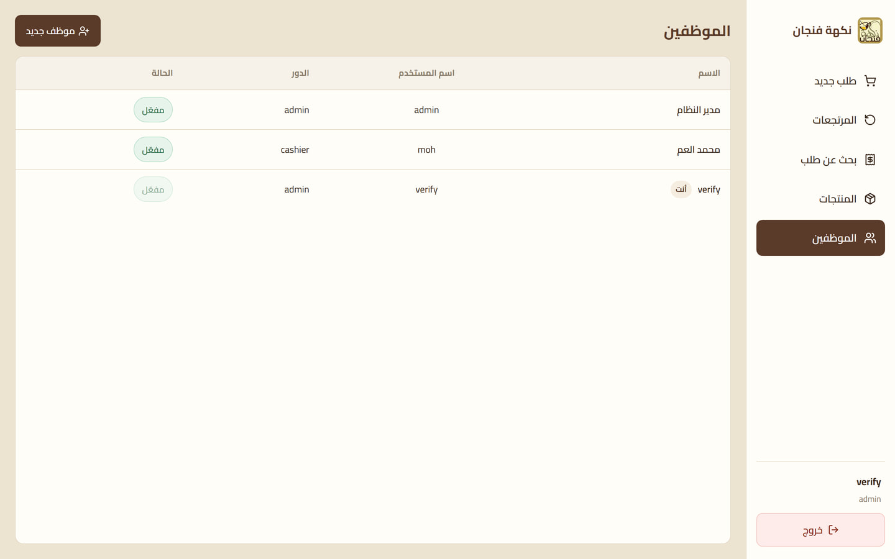
</div>

<div align="center"><sub>Ordering with live point redemption · Catalogue · Partial returns with point clawback · Staff & roles</sub></div>

### Marketing site — bilingual AR/EN

<div align="center">
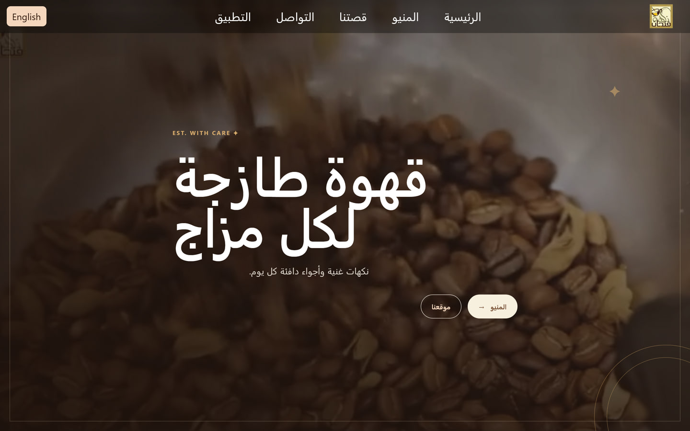
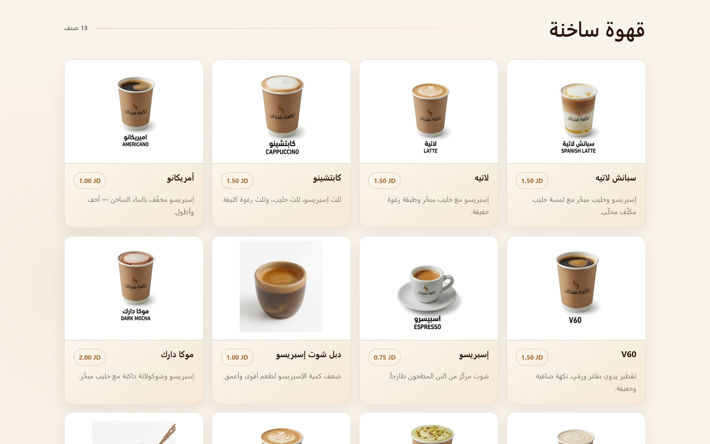
</div>
<div align="center">
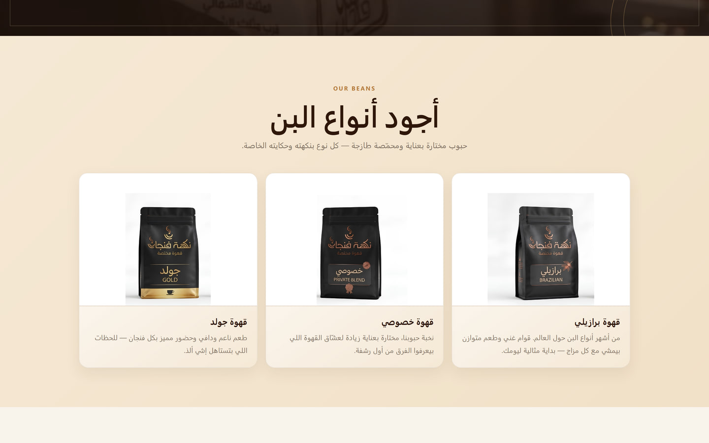
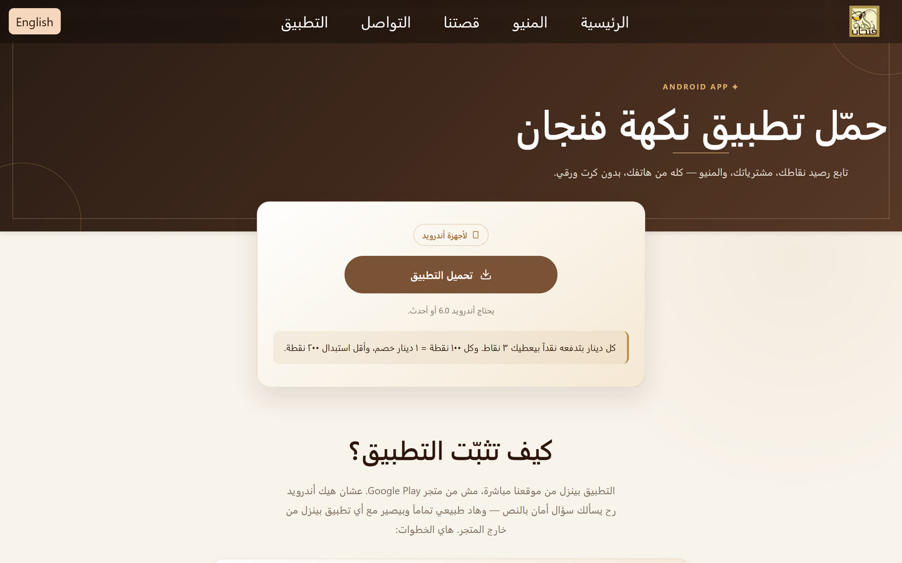
</div>

<div align="center"><sub>Home · Menu — 40 products, every one photographed · The bean range · The Android download page with sideload instructions</sub></div>

#### On a phone

<div align="center">
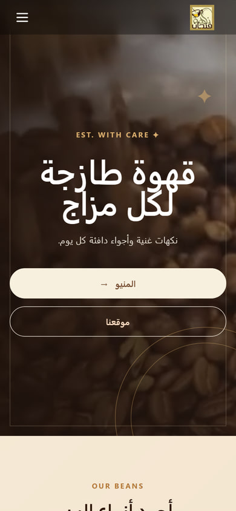
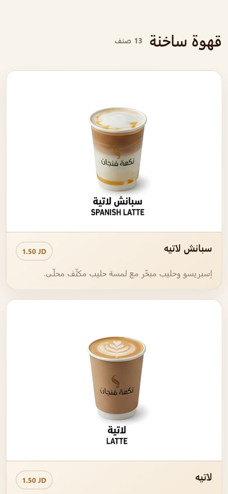
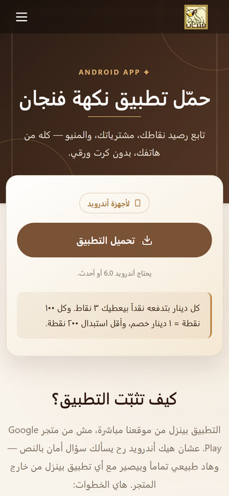
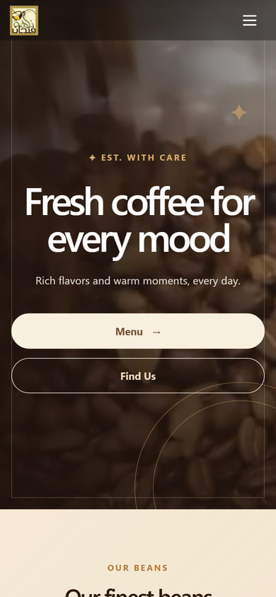
</div>

<div align="center"><sub>Most visitors arrive on a phone. Zero horizontal overflow at 320/375/390&nbsp;px, 44&nbsp;px tap targets, and a real navigation menu — the last one was a bug, see below.</sub></div>

---

## Architecture

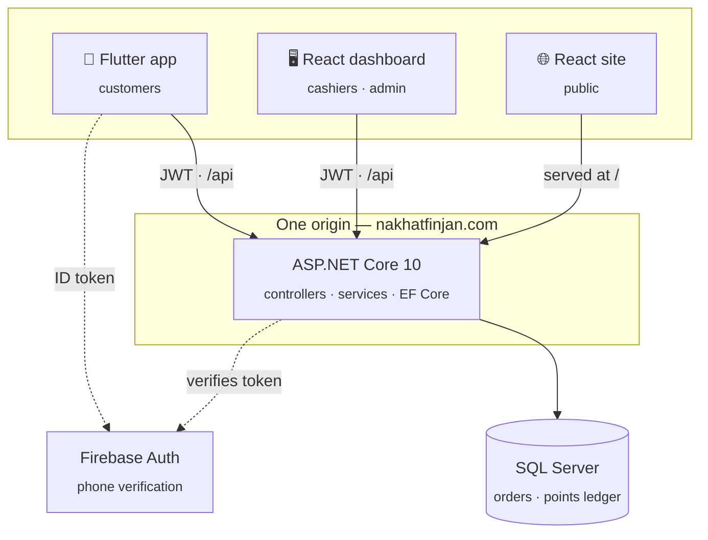

**Why one origin:** the dashboard's API client is one line — `const BASE = '/api'`. Same origin means no CORS, no preflight, no second hostname to certify. The Flutter app is the only remote client.

---

## The interesting problems

This is the part worth reading. Every item below is a real problem this project hit, and how it was resolved.

### 1. A points balance that can never silently drift

Every customer row carries a denormalised `PointsBalance`, because the app reads it on every launch and summing a ledger per request does not scale. Denormalised totals rot.

The invariant is explicit: **`Customer.PointsBalance` must always equal `SUM(PointsTransaction.Amount)`** for that customer. `docs/verification.sql` finds any customer whose stored balance has drifted from its ledger, and the rule is that a drift is never patched — it is traced to the bug that caused it.

Every balance write is a **conditional UPDATE guarded by the expected value**, so two concurrent writes cannot both succeed.

### 2. Double-charging a customer because the cashier tapped twice

A flaky connection at the till means the cashier taps "confirm" again. Without protection that is two orders and two point grants.

Orders carry a client-generated **idempotency key** with a unique index. A replay does not create a second order — it finds the winning row and returns *that* order's receipt, so the cashier sees the same result either way rather than an error they have to interpret.

### 3. Two people editing one order at the same time

Cancellation and returns both mutate an order and its points. Interleaved, they can double-refund.

Both paths open their transaction with `SELECT … WITH (UPDLOCK, HOLDLOCK)` as the **first statement**. A second writer blocks, then re-reads the state the first one committed, so the ordinary guards (`ORDER_ALREADY_CANCELLED`, `RETURN_EXCEEDS_QUANTITY`) reject it on the normal path. No new error codes, no optimistic-concurrency retry loop.

### 4. Migrating 67 paper punch cards

The shop's existing customers had balances earned at **5 points per dinar**. The system runs at **3**. Importing them as fake orders would have polluted every future sales report with revenue that never happened; writing the balance column directly would have broken the invariant in §1 on day one.

They were imported as a distinct `OpeningBalance` transaction type — real ledger rows, no fake orders, invariant intact. A **filtered unique index** on `(CustomerId) WHERE Type = 'OpeningBalance'` means the database itself refuses a second import, because the app-level "already imported?" check is a TOCTOU race and the index is the real guarantee.

The import script is deliberately **not in this repository**: it is 67 real phone numbers.

### 5. Revoking a token that is stateless by design

JWTs are not revocable, but a cashier who is let go must stop working immediately.

Both `Customer` and `Employee` carry a `TokenVersion` written into the token as a claim and **re-checked on every authenticated request**. Deactivating an employee increments it and every token they hold dies at once. The cost — one indexed lookup per request — was measured and accepted.

### 6. A splash screen that hung forever

Found on a real device during release testing. `flutter_secure_storage` failed to decrypt the stored JWT (`BadPaddingException: BAD_DECRYPT`, which happens when Android restores backed-up preferences against a freshly generated keystore key). The exception escaped an un-awaited future started in `initState`, so the navigation line **was never reached** — no spinner, no error, no way out but reinstalling.

Fixed at three levels: the plugin's own `resetOnError`, a `getToken()` that treats an unreadable token as "signed out" and drops it, and a guard around the splash's own async work so no future failure can strand a user there again. Covered by a regression test.

### 7. Serving three apps from one origin without them fighting

Order matters and the failure modes are quiet:

- `/api/*` must 404 on a typo. Falling through to HTML would answer `fetch()` with `200` and a page of markup, and the client parses it as JSON — the real error surfaces as an unintelligible parse failure.
- `/dashboard/*` gets the dashboard's `index.html`.
- **Everything else** gets the site's, which is what keeps `/menu` working on a refresh or a pasted link.

Also: `.apk` is **not** in ASP.NET Core's default content-type table and the static file middleware refuses to serve an extension it does not know. The download link answered 404 with nothing in the log to say why, until the MIME type was registered explicitly.

### 8. Arabic, right-to-left, everywhere

Not a translation layer bolted on — RTL is the default across all three clients. Numerals, currency, dates, icon direction, and layout mirroring were designed in rather than patched. The marketing site switches AR/EN and flips `dir` at the document level.

A mobile audit found the site's five navigation links and the language switch were **laid out entirely off-screen** on phones, with no way to reach them and no visible overflow to hint at it. Rebuilt as a proper mobile menu; every page now measures zero horizontal overflow at 320/375/390 px.

---

## Tech stack

| Layer | Stack |
|---|---|
| **API** | ASP.NET Core 10 · EF Core 10 · SQL Server · JWT bearer · BCrypt · Firebase Admin SDK |
| **Dashboard** | React 19 · Vite 8 · plain CSS · on-screen keyboard for touch tills |
| **Site** | React 19 · Vite 8 · React Router 7 · Motion · EmailJS |
| **Mobile** | Flutter 3.32 · Provider · Dio · `flutter_secure_storage` · Firebase Auth |
| **Hosting** | MonsterASP.NET (IIS, in-process) behind Cloudflare |

**5** EF Core migrations · **39** documented architecture decisions · **16** Flutter widget tests

---

## Repository layout

```
backend/CoffeeLoyalty.Api/   ASP.NET Core API — controllers, services, EF Core, migrations
dashboard/                   React POS for cashiers and the owner
website/                     Public marketing site (Arabic / English)
mobile/nakhat_finjan/        Flutter customer app
docs/                        API contract, ERD, decision log, deployment runbook, SQL
```

`docs/decisions.md` is the one to read: 39 decisions with the alternative that was rejected and why. Superseded decisions are kept with their original text and a supersession note rather than quietly edited.

---

## Running it locally

**Prerequisites:** .NET 10 SDK · Node 20+ · Flutter 3.32+ · SQL Server LocalDB

```bash
# 1. Database
cd backend/CoffeeLoyalty.Api
dotnet ef database update

# 2. Secrets (never committed)
dotnet user-secrets set "Jwt:Secret" "<at least 32 random characters>"
dotnet user-secrets set "Seed:AdminUsername" "admin"
dotnet user-secrets set "Seed:AdminPassword" "<strong password>"

# 3. API  → http://localhost:5286
dotnet run --launch-profile http

# 4. Dashboard  → http://localhost:5173/dashboard/
cd ../../dashboard && npm install && npm run dev

# 5. Site  → http://localhost:5173
cd ../website && npm install && npm run dev
```

**Mobile:** needs `google-services.json` and `lib/firebase_options.dart` from your own Firebase project — both are gitignored because they carry API keys. See `mobile/nakhat_finjan/README-firebase.md`.

```bash
cd mobile/nakhat_finjan && flutter pub get && flutter run
```

Full production steps, environment variables and post-deploy checks: **`docs/DEPLOYMENT.md`**.

---

## Android app

Signed release builds are published under [**Releases**](../../releases). The app is not on Google Play yet, so the site's [download page](https://nakhatfinjan.com/download) carries step-by-step sideload instructions — including why Android shows a security warning for any app installed from outside the store, which is where most people abandon the install.

Release signing is configured through `android/key.properties` (gitignored). If it is absent the build still succeeds with the debug key **and prints a loud warning**, because a build that quietly signs with the debug key and looks finished is exactly how a debug-signed APK ends up on a download page.

---

## Status

Live in production at **[nakhatfinjan.com](https://nakhatfinjan.com)** — site, dashboard and API on one deployment.

Known gaps are tracked honestly rather than hidden: there is no reports endpoint yet, no password-change screen, and the backend has no automated test suite. See `docs/decisions.md` for what was deferred and why.

---

<div align="center">
<sub>Built for نكهة فنجان — Al-Rusaifa, Yajouz Road, Zarqa, Jordan</sub>
</div>
