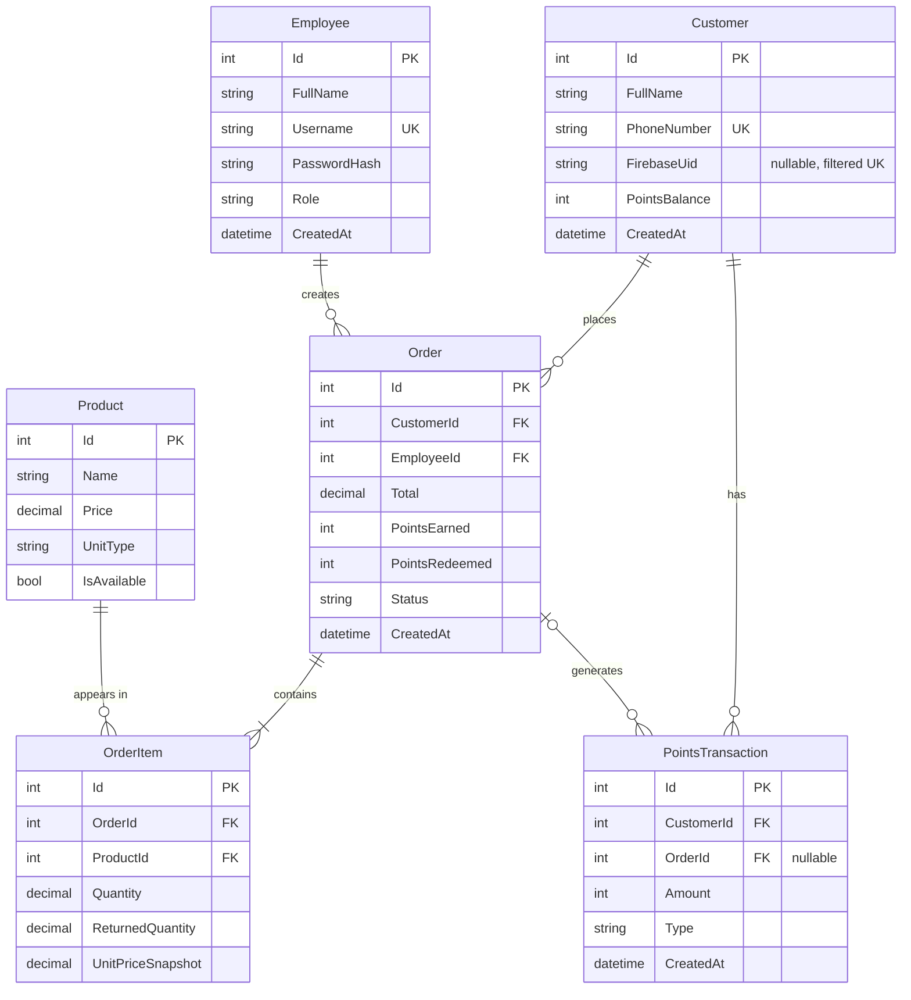

# Coffee Loyalty System — ERD

## Column Notes

- **Customer.PhoneNumber**: NOT NULL + regular UK — the phone number is the customer's identity in the system; a customer without a phone number does not exist. All numbers are stored strictly in E.164 format (`+9627XXXXXXXX`) after normalizing any manual input. The backend rejects any number that doesn't match a valid Jordanian format after normalization — strict validation on manual entry.
- **Customer.FirebaseUid**: nullable — linked on first firebase-login. Customers registered by the cashier keep a NULL UID until their first app login; their balance is preserved and linked automatically (matched via normalized PhoneNumber). Uniqueness is enforced with a **filtered unique index** (`WHERE FirebaseUid IS NOT NULL`) — SQL Server treats NULL as a value in a regular unique index, so any two cashier-registered customers would break it.
- **Customer.PointsBalance**: denormalized (performance decision). Updated exclusively via atomic SQL increment (`ExecuteUpdateAsync`: `SET PointsBalance = PointsBalance + @delta`) inside the same DB transaction — never read-modify-write, so concurrent operations can't overwrite each other.
- **Product.UnitType**: `Piece` or `Kg` — determines whether Quantity is a count or a weight.
- **Order.Status**: `Completed` or `Cancelled`.
- **Cancellation (Status = Cancelled)**: reverses points in both directions — claws back PointsEarned and refunds PointsRedeemed, via transactions linked to the same OrderId. Partial-return details and calculations live in the api-contract (Returns section, week 2).
- **Order.Total**: full order value — always equals the sum of its lines (`Σ Quantity × UnitPriceSnapshot`). Cash paid is **computed**, never stored.
- **Order.PointsRedeemed**: points spent on this order — defaults to 0. Subject to the redemption constraints below; any order request violating them is rejected with a validation error before anything is written.
- **Order.PointsEarned**: calculated on cash paid only, not on Total (decision 9).
- **OrderItem.Quantity**: decimal to support both weight (1.5 kg) and count (2 pieces).
- **OrderItem.ReturnedQuantity**: defaults to 0 — supports partial returns.
- **OrderItem.UnitPriceSnapshot**: unit price at order time — frozen, unaffected by catalog price changes.
- **PointsTransaction.OrderId**: nullable — links to the order that generated the transaction; empty for manual adjustments.
- **PointsTransaction.Type**: `Earn` / `Redeem` / `Refund` / `ManualAdjustment`.
- **PointsTransaction.Amount**: the sign reflects the effect on the balance (positive = increase, negative = decrease) — Type describes the reason, not the sign.
- **Rates**: `PointsPerDinar = 5` and `RedeemRate = 100` live in `LoyaltyConstants` — one place, not buried in formulas.

## Core Formulas

- Order total: `Total = Σ (Quantity × UnitPriceSnapshot)`
- Cash paid: `CashPaid = Total − (PointsRedeemed / RedeemRate)`
- Points earned: `PointsEarned = floor(CashPaid × PointsPerDinar)`

### Redemption Constraints (validated at order creation)

- `PointsRedeemed ≤ Customer.PointsBalance` — a customer can't spend points they don't have.
- `PointsRedeemed / RedeemRate ≤ Total` — CashPaid can never go negative; otherwise the formulas above would produce a negative PointsEarned and the system would *deduct* points from a paying customer.

> Worked example: order Total = 6 JOD, PointsRedeemed = 200 → CashPaid = 6 − (200/100) = 4 JOD → PointsEarned = floor(4 × 5) = **20 points**