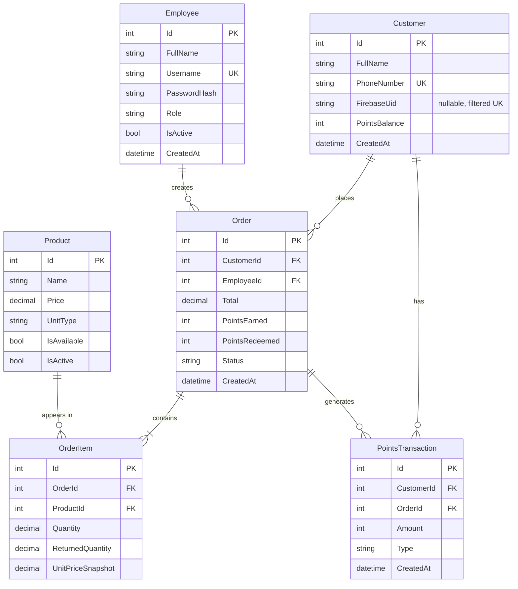

# Coffee Loyalty System — ERD



## Column Notes

- **Customer.PhoneNumber**: NOT NULL + regular UK — the phone number is the customer's identity in the system; a customer without a phone number does not exist. All numbers are stored strictly in E.164 format (`+9627XXXXXXXX`) after normalizing any manual input. The backend rejects any number that doesn't match a valid Jordanian format after normalization — strict validation on manual entry.
- **Customer.FirebaseUid**: nullable — linked on first firebase-login. Customers registered by the cashier keep a NULL UID until their first app login; their balance is preserved and linked automatically (matched via normalized PhoneNumber). Uniqueness is enforced with a **filtered unique index** (`WHERE FirebaseUid IS NOT NULL`) — SQL Server treats NULL as a value in a regular unique index, so any two cashier-registered customers would break it.
- **Customer.PointsBalance**: denormalized (performance decision). **Increases** (Earn, RedeemReversal): atomic increment inside the DB transaction — `SET PointsBalance = PointsBalance + @delta`. **Decreases** (Redeem, Refund): conditional atomic UPDATE — `SET PointsBalance = PointsBalance - @x WHERE Id = @id AND PointsBalance >= @x` — with a rows-affected check; 0 rows = operation rejected. The check and the deduction are one statement, never a separate read-then-write (TOCTOU). Guarantees PointsBalance ≥ 0 always, even under double-submit from the cashier device.
- **Product.UnitType**: `Piece` or `Kg` — determines whether Quantity is a count or a weight.
- **Product.IsAvailable**: out of stock today — temporary, toggled by the cashier.
- **Product.IsActive**: on the menu at all — permanent, toggled by the admin. `DELETE /api/products/{id}` sets this to false (soft delete). Physical DELETE never happens; old OrderItems keep their FK reference. See decisions.md #14.
- **Order.Status**: `Completed` or `Cancelled`.
- **Cancellation (Status = Cancelled)**: allowed **only if** no partial return exists on the order (every OrderItem.ReturnedQuantity = 0) — otherwise points would be reversed twice. Once any partial return happens, the only path is completing returns line by line. Cancellation reverses points in both directions: claws back PointsEarned (`Refund`, negative) and restores PointsRedeemed (`RedeemReversal`, positive), both linked to the same OrderId. Partial-return details and calculations live in the api-contract (Returns section, week 2).
- **Return window**: returns and cancellations are accepted only within `ReturnWindowDays = 1` of Order.CreatedAt, compared in **Jordan time, not UTC**. See decisions.md #16.
- **Order.Total**: full order value — always equals the sum of its lines (`Σ Quantity × UnitPriceSnapshot`). Cash paid is **computed**, never stored.
- **Order.PointsRedeemed**: points spent on this order — defaults to 0. Subject to the redemption constraints below; any order request violating them is rejected with a validation error before anything is written.
- **Order.PointsEarned**: calculated on cash paid only, not on Total (decision 9).
- **OrderItem.Quantity**: decimal to support both weight (1.5 kg) and count (2 pieces).
- **OrderItem.ReturnedQuantity**: defaults to 0 — supports partial returns.
- **OrderItem.UnitPriceSnapshot**: unit price at order time — frozen, unaffected by catalog price changes.
- **PointsTransaction.OrderId**: NOT NULL — every points movement has a justifying order, no exceptions. Manual adjustments were removed by design (decisions.md #12): the schema itself forbids sourceless points movements.
- **PointsTransaction.Type**: `Earn` / `Redeem` / `Refund` / `RedeemReversal`. `Refund` is always negative (clawing back earned points on return/cancellation); `RedeemReversal` is always positive (restoring spent points on cancellation). Kept as separate types so reports can distinguish them.
- **PointsTransaction.Amount**: the sign reflects the effect on the balance (positive = increase, negative = decrease) — Type describes the reason, not the sign.
- **Rates**: `PointsPerDinar = 5`, `RedeemRate = 100`, `MinRedeemPoints = 250`, and `ReturnWindowDays = 1` live in `LoyaltyConstants` — one place, not buried in formulas.
- **Employee.IsActive**: defaults to true. Deactivating an employee
  (resignation/termination) is done via `IsActive = false` through
  `PATCH /api/employees/{id}/status` (admin only) — never a physical
  delete; the employee is referenced by old Orders via FK (same soft-delete
  logic as products, decision 14). Login rule: `IsActive = false` → rejected
  with 401.

## Database CHECK Constraints (last line of defense)

Enforced in the initial EF Core migration — if any future bug tries to break these rules, the database throws instead of silently storing corruption:

```sql
ALTER TABLE Customers ADD CONSTRAINT CK_Customer_Balance
    CHECK (PointsBalance >= 0);

ALTER TABLE OrderItems ADD CONSTRAINT CK_OrderItem_Returned
    CHECK (ReturnedQuantity >= 0 AND ReturnedQuantity <= Quantity);

ALTER TABLE Orders ADD CONSTRAINT CK_Order_Points
    CHECK (PointsEarned >= 0 AND PointsRedeemed >= 0);
```

## Core Formulas

- Order total: `Total = Σ (Quantity × UnitPriceSnapshot)`
- Cash paid: `CashPaid = Total − (PointsRedeemed / RedeemRate)`
- Points earned: `PointsEarned = floor(CashPaid × PointsPerDinar)`

### Redemption Constraints (validated at order creation)

- `PointsRedeemed = 0` **or** `PointsRedeemed ≥ MinRedeemPoints (250)` — shop owner's minimum per redemption. Effectively no redemption on orders under 2.5 JOD — deliberate (encourages larger orders), not a bug. See decisions.md #9.
- `PointsRedeemed ≤ Customer.PointsBalance` — enforced via the conditional atomic UPDATE described in the PointsBalance note, not a separate pre-read check.
- `PointsRedeemed / RedeemRate ≤ Total` — CashPaid can never go negative; otherwise the formulas above would produce a negative PointsEarned and the system would *deduct* points from a paying customer.

> Worked example: order Total = 6 JOD, PointsRedeemed = 250 → CashPaid = 6 − (250/100) = 3.5 JOD → PointsEarned = floor(3.5 × 5) = floor(17.5) = **17 points**